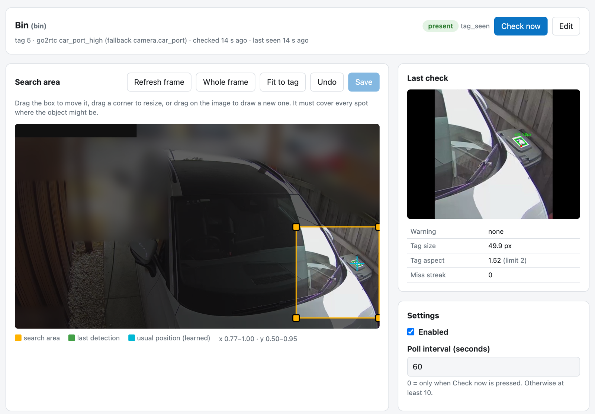

# TagSense

**📖 Documentation: [lsnewman.github.io/ha-tagsense](https://lsnewman.github.io/ha-tagsense/)**

A Home Assistant app (formerly "add-on") that uses cameras you already have
to answer two kinds of question:

- **[TagSense Presence](https://lsnewman.github.io/ha-tagsense/presence/): is
  it in its usual place?** Stick a printed AprilTag on something, such as a
  wheelie bin, a car, a chair or a garage door. TagSense looks for that tag in
  camera frames and reports **present / absent / unknown**, plus how far the
  tag is turned (to tell when a bin comes back the wrong way round). A cheap,
  deterministic alternative to an image classifier for "is the bin out?"
  questions.
- **[TagSense Access](https://lsnewman.github.io/ha-tagsense/access/): is this
  a valid code?** Someone holds up a QR code on their phone to a camera, for
  example a doorbell, a gate or garage camera. TagSense checks it and reports a
  **verified** event (or why not). Codes are rotating passes for Home Assistant
  users, or time-limited codes you send to someone. Access is **off until you
  turn it on**, and it **never unlocks anything** itself: your automations
  decide what a verified code does, and confirm it with TagSense first.

Both are managed from a **TagSense panel** in the Home Assistant sidebar, and
everything appears in Home Assistant through MQTT discovery.

> **Status: early.** Presence was developed and tested with a wheelie bin on
> one camera, by day and at night under the camera's IR. Access was tested on
> one camera, with codes shown on a phone. It has had one user. See
> [Limitations](https://lsnewman.github.io/ha-tagsense/limitations/).

## Quick start

You need Home Assistant OS or Supervised (amd64 or aarch64), the Mosquitto
broker app with the MQTT integration, and a camera as a go2rtc stream (for
example Frigate's) or a Home Assistant camera.

1. Add this repository (the badge above, or **Settings → Apps → App store →
   ⋮ → Repositories** and add `https://github.com/lsnewman/ha-tagsense`).
2. Install **TagSense**, set `go2rtc_url` on the Configuration tab if you use
   go2rtc, and start it.
3. Open **TagSense** in the sidebar and add your first object.

Next steps:

- **Presence** (tagged objects): [Getting started](https://lsnewman.github.io/ha-tagsense/getting-started/)
  walks through installing and setting up your first object.
- **Access** (QR codes at a camera): [Setting up Access](https://lsnewman.github.io/ha-tagsense/access/setup/)
  covers turning it on, passes and codes, and testing.

For locks, the unlock blueprint confirms each code with TagSense, then unlocks
one or more locks and locks them again:

## Documentation

| | |
|---|---|
| [Getting started](https://lsnewman.github.io/ha-tagsense/getting-started/) · [The panel](https://lsnewman.github.io/ha-tagsense/panel/) | Install, first object, the panel's sections, links to a page |
| [Presence](https://lsnewman.github.io/ha-tagsense/presence/) | How a check works, tags and printing, objects and settings, entities and automations, rotation |
| [Access](https://lsnewman.github.io/ha-tagsense/access/) | Setting up, codes, scanners, events and confirming, the unlock blueprint, security |
| [Health and troubleshooting](https://lsnewman.github.io/ha-tagsense/health/) · [Upgrading](https://lsnewman.github.io/ha-tagsense/upgrading/) · [Limitations](https://lsnewman.github.io/ha-tagsense/limitations/) | |

The pages are Markdown in [`docs/`](docs/), so they are versioned with the
code. The [CHANGELOG](tagsense/CHANGELOG.md) has every change.

## AI usage disclaimer

This project was built with substantial help from AI: the code, tests and
documentation were written by an AI coding agent (Anthropic's Claude, through
Claude Code), directed by the maintainer, who set the requirements, made the
design decisions, supplied the real camera frames used for calibration, and
tested each release on their own Home Assistant. Thresholds were set from
measurements on real frames, not from the AI's reasoning alone. There has been
**no independent human code review or security review**. Treat it as
experimental software, and read the code before relying on it for anything
that matters, especially a lock. More in
[AI usage](https://lsnewman.github.io/ha-tagsense/ai-usage/).

## Licence

MIT. See [LICENSE](LICENSE).
