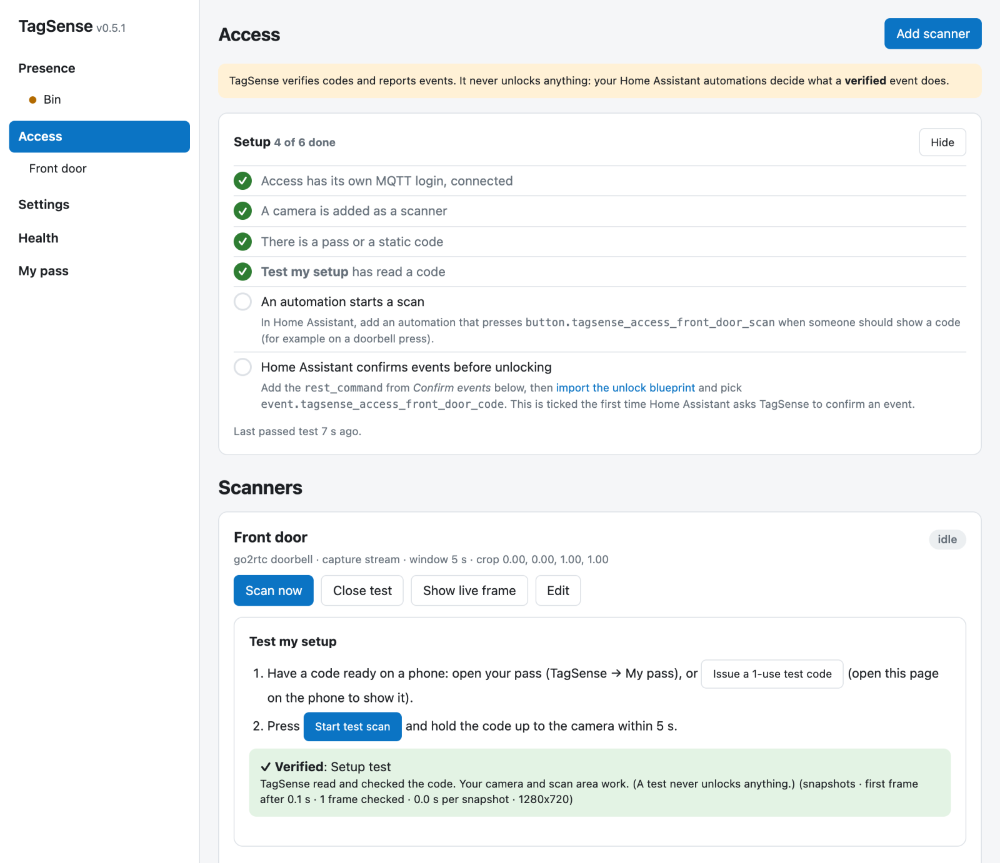

# TagSense Access

**Is this a valid code?** When something starts a scan (a doorbell press, a
button, a motion sensor, anything an automation can see), someone holds up a
QR code on their phone to a camera. TagSense checks it and reports a
**verified** event, or why not, to Home Assistant. What happens next is up to
your automations: a notification, a light, or, if you decide to, unlocking a
door or opening a gate.

!!! danger "TagSense never unlocks anything"
    It holds no lock credentials and has no path to a lock. It verifies codes
    and reports events; your automations act on them. For anything that
    matters, the automation asks TagSense to **confirm** each event first, so a
    faked message cannot open anything. See
    [Events and confirming](events.md).

Access is **off until you turn it on**, and Presence works the same either way.

## How it fits together

1. [**Turn it on**](setup.md) with its own MQTT login, then follow the setup
   checklist on the Access page.
2. Give people [**codes**](codes.md): a rotating **pass** for Home Assistant
   users, or a time-limited **static code** to send to someone.
3. Add a [**scanner**](scanners.md): the camera that reads codes, and the
   area where people hold up their phone.
4. An **automation starts a scan** (for example on a doorbell press). The scan
   ends at the first verified code, or when its time is up.
5. TagSense reports an [**event**](events.md). For a lock, an automation
   confirms it with TagSense and unlocks; the
   [**unlock blueprint**](blueprint.md) does this for one or more locks.

Read [Security](security.md) before letting it near a lock.
