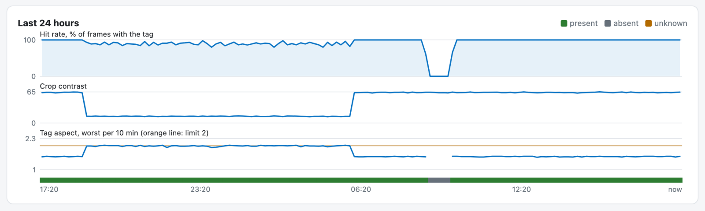

# The panel

The app adds a **TagSense** entry to the Home Assistant sidebar. On a computer
the panel has a sidebar of its own; on a phone the same sections are tabs along
the top.

| Section | What is there |
|---|---|
| **Presence** | Every object with its state, latest image and a *Check now* button. Each object is listed in the sidebar with a coloured dot for its state. |
| **Access** | The setup checklist, passes, static codes, *Confirm events*, and each scanner with *Scan now*, *Test my setup* and a live frame. While Access is off, this page explains what it does and how to turn it on. |
| **Settings** | The detection settings shared by every object, and **Backup** (export / import). |
| **Health** | Whether everything is working, with a debug bundle to download. A badge on the tab counts anything that needs a look. |
| **My pass** | Your own Access pass, if you have one. |

## An object's page

- **Search area editor:** a live frame from the object's camera with the search
  area as a box. Drag it to move it, drag a corner to resize it, or drag on the
  image to draw a new one. The last detection (green) and the learned usual
  position (cyan) are drawn on the frame, and an arrow shows which way the
  tag's top points now (solid) and at 0° (dashed). **Fit to tag** sets the box
  to the learned position plus 3x the tag size on each side. Saving runs a check.
- **Last check** and **Settings:** Enabled, Poll interval, Rotation steps and
  *Set current orientation as 0°*. These are the same settings as the Home
  Assistant entities, so changes show in both places.
- **Last 24 hours:** a chart of the hit rate, crop contrast, tag aspect (against
  the shape gate) and rotation in 10-minute steps, over a band showing the
  reported state. Kept across restarts; hover for details.
- **Recent checks** (the last 50) and the **last ignored or rejected read** with
  its image.
- **State changes:** the checked image each time the reported state or the
  stepped rotation changed (the last 20).
- **Diagnostics**, **Use in automations**, **Print tag** and **Delete**.

## Who sees what

Every Home Assistant user sees the TagSense sidebar entry. **Admins** get the
whole panel; **everyone else only gets My pass**: their own pass, if an admin
has given them one. TagSense asks Home Assistant who is an admin. If it cannot
tell (for example while Home Assistant is restarting), nobody counts as an
admin until it can.

## Links to a page

Each page has its own address under the sidebar entry, so a dashboard button
with the tap action *Navigate* can open one directly, and the browser's Back
button and bookmarks follow the panel:

| Path | Page | Who |
|---|---|---|
| `/<panel>/pass` | My pass (the page shows its exact path) | anyone |
| `/<panel>/obj/<object id>` | an object's page | admins |
| `/<panel>/access`, `/<panel>/settings`, `/<panel>/health` | those sections | admins |

`<panel>` is the path you see when you open TagSense from the sidebar, for
example `/744e9206_tagsense`. This needs TagSense opened as a panel in Home
Assistant; it does not work when the panel is embedded in a dashboard card.
